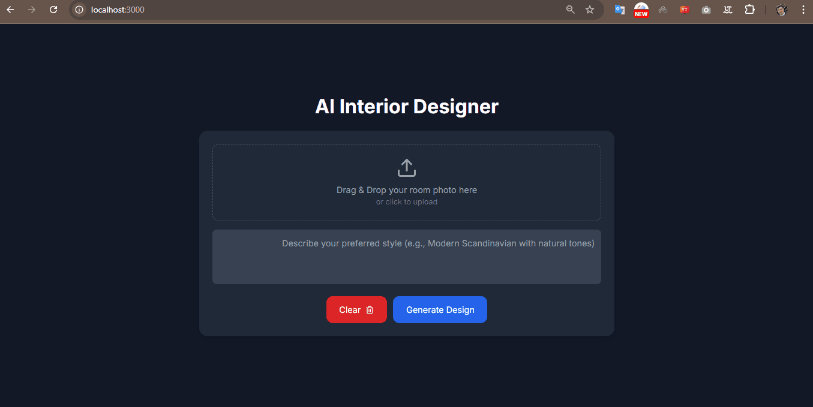
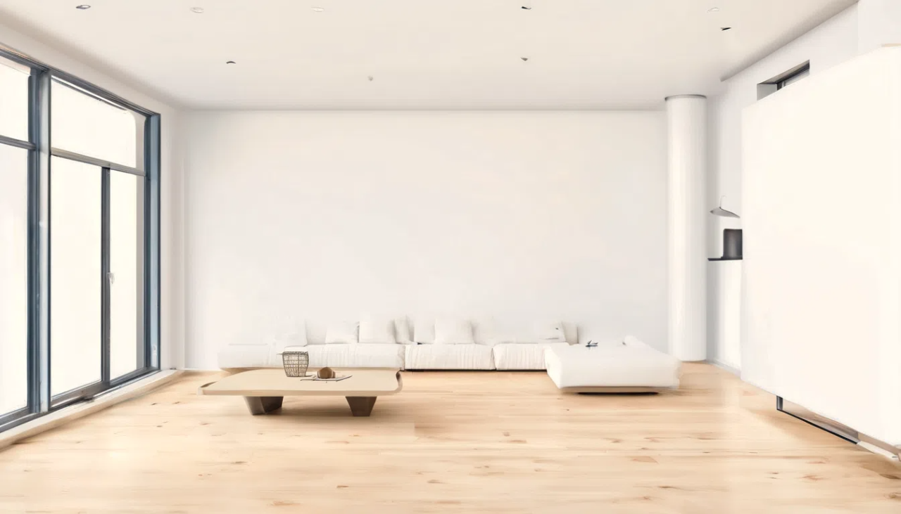

# 🏠 AI Interior Designer

An AI-powered app that generates **interior design mockups** from your room photos.  
Upload a picture of your room, choose your preferred design style, and get a redesigned version instantly.

---

## 📸 Demo




---

## ✨ Features

- 📤 Upload a room photo
- 🎨 Choose or describe your design style
- 🤖 AI generates a realistic interior mockup
- 💾 Download the result
- 🌓 Clean & modern dark UI

---

## 🚀 Tech Stack

- **Frontend:** React (Vite, TailwindCSS, framer-motion, lucide-react)
- **Backend:** Python (FastAPI / Flask), Stability AI API
- **Deployment:** Docker-ready

---

## 🔧 Installation

### 1️⃣ Clone the repo

```bash
git clone https://github.com/YOUR_USERNAME/ai-interior-designer.git
cd ai-interior-designer

---

## 2️⃣ Setup Backend
cd backend
python -m venv venv
source venv/bin/activate   # Linux / Mac
venv\Scripts\activate      # Windows

pip install -r requirements.txt
cp .env.example .env   # add your Stability API key inside
--
Start backend:
uvicorn main:app --reload

---

## 3️⃣ Setup Frontend
cd frontend
npm install
npm run dev

---
Then open 👉 http://localhost:5173
---

📂 Project Structure

ai-interior-designer/
│── backend/      # FastAPI backend + Stability AI API integration
│── frontend/     # React + Tailwind frontend
│── README.md     # This file


